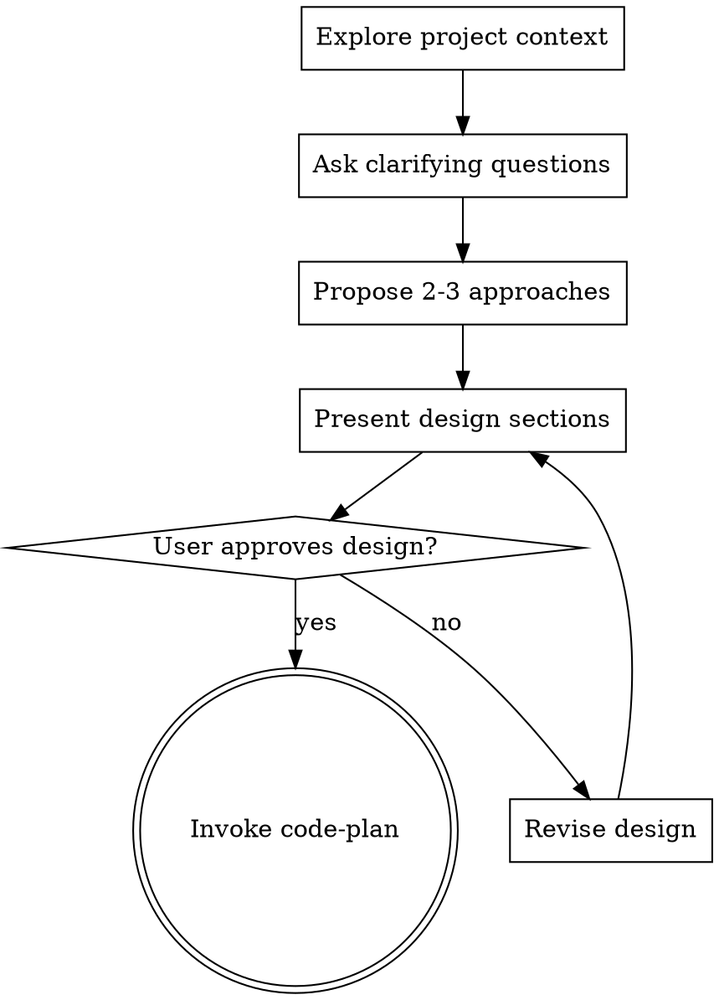

# Code Brainstorm

## Critical Constraints
- I do not take implementation action before presenting a design and getting approval.
- I do not treat "simple" requests as justification to skip design.

<HARD-GATE>
Do NOT invoke any implementation skill, write any code, scaffold any project, or take any implementation action until you have presented a design and the user has approved it. This applies to EVERY project regardless of perceived simplicity.
</HARD-GATE>

## Overview
Explore coding approaches before writing code.

The outcome is an approved design direction that can be handed to `code-plan`.

## Process
1. Read the current codebase context, recent changes, and relevant requirements.
2. Ask clarifying questions one at a time.
3. Propose 2-3 approaches with tradeoffs and a recommendation.
4. Present the design in sections sized to the problem complexity.
5. Record assumptions and open questions.
6. Get approval on the design direction.
7. Hand off to `code-plan`.

## Process Flow

## Red Flags
- Starting code because the request looks small.
- Asking multiple unrelated questions in one turn.
- Offering only one approach when there are real tradeoffs.
- Moving to implementation before the design is approved.
