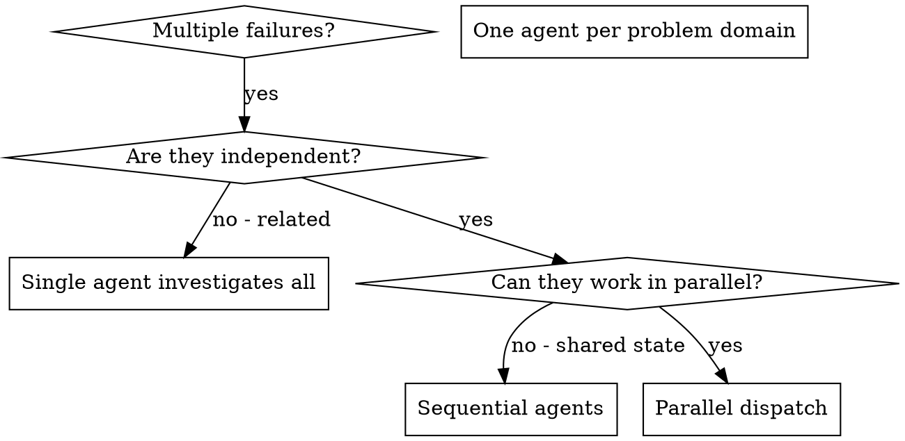

# Ops Parallel

## Critical Constraints

- I do not assume collaboration or subagent dispatch is available in every runtime.
- If the runtime cannot dispatch helpers in parallel, I keep the same task decomposition but execute the slices sequentially in one controller session.
- I do not describe sequential fallback as real parallel execution.

## Overview

When runtime support exists, you can delegate tasks to specialized agents with isolated context. By precisely crafting their instructions and context, you keep each slice focused and reviewable. When runtime support does not exist, keep the same slice boundaries and execute them sequentially instead of pretending the environment supports real parallel dispatch.

When you have multiple unrelated operational problems or task slices, investigating them sequentially wastes time. Each investigation is independent and can happen in parallel.

**Core principle:** Keep one isolated slice per independent problem domain, then execute those slices concurrently only when the runtime actually supports it.

## Runtime Fallback Note

Current SDTK truth treats helper-dispatch availability as environment-dependent and does not guarantee parallel helper dispatch in every environment.

If collaboration or subagent dispatch is unavailable:
- keep the same independence test
- prepare the same focused task slices
- execute those slices sequentially in one controller session
- preserve the same verification and fan-in discipline

Do not claim runtime parity or actual concurrent dispatch when the environment only supports sequential execution.

## When to Use



**Use when:**
- multiple infrastructure failures have different root causes
- multiple subsystems need work independently
- each problem can be understood without context from the others
- no shared state exists between investigations

**Do not use when:**
- failures are related (fixing one might fix others)
- you need to understand the full system state first
- agents would interfere with each other

## The Pattern

### 1. Identify Independent Domains

Group failures by what is broken:
- monitoring alert thresholds
- CI/CD deployment gates
- backup retention procedures

Each domain is independent. Fixing monitoring thresholds should not affect backup retention.

### 2. Create Focused Agent Tasks

Each agent gets:
- **Specific scope:** one subsystem, environment, or operational workflow
- **Clear goal:** solve exactly one task slice
- **Constraints:** do not change unrelated code or infrastructure
- **Expected output:** summary of what was found and what changed

### 3. Dispatch or Execute the Slices

```text
Task("Tune monitoring alerts for checkout service")
Task("Fix CI deployment gate for staging rollouts")
Task("Update backup retention procedure and verification notes")
```

If runtime dispatch is available, all three can run concurrently. Otherwise execute the three slices sequentially with the same scope boundaries and verification plan.

### 4. Review and Integrate

When agents return:
- read each summary
- verify fixes do not conflict
- run the top-level verification for the combined result
- integrate all accepted changes

## Agent Prompt Structure

Good agent prompts are:
1. **Focused** - one clear problem domain
2. **Self-contained** - all context needed to understand the problem
3. **Specific about output** - what the agent should return

```markdown
Fix the monitoring configuration for checkout alerts:

1. alert fires on every rollout even when service recovers within 30 seconds
2. paging threshold should reflect sustained error rate, not one failed probe
3. do not change CI/CD or backup files

Your task:

1. read the current alert config and related runbook
2. identify the root cause of noisy alerts
3. fix only the monitoring slice
4. return a short summary of root cause and changes

Do NOT refactor unrelated infrastructure.
```

## Common Mistakes

**Bad:** "Fix all infra issues" - agent gets lost  
**Good:** "Fix checkout monitoring alerts" - focused scope

**Bad:** "Fix the pipeline" - no context  
**Good:** include failing step names, exact files, and constraints

**Bad:** no constraints - agent may refactor everything  
**Good:** "Do NOT touch unrelated systems"

**Bad:** vague output - you do not know what changed  
**Good:** "Return summary of root cause and changes"

## When NOT to Use

**Related failures:** fixing one might fix others, so investigate together first  
**Need full context:** understanding requires seeing the whole system  
**Exploratory debugging:** you do not know what is broken yet  
**Shared state:** agents would interfere by editing the same files or environments

## Real Example from Session

**Scenario:** three independent operations tasks after a reliability review

**Tasks:**
- monitoring setup for checkout alerts needs tuning
- CI/CD pipeline rollout gate is missing a health checkpoint
- backup procedure lacks a restore verification note

**Decision:** independent domains. Monitoring, CI/CD, and backup procedures can be investigated separately.

**Dispatch:**
```
Agent 1 -> Fix monitoring alert configuration
Agent 2 -> Fix CI/CD rollout gate
Agent 3 -> Fix backup verification procedure
```

**Results:**
- Agent 1: tuned thresholds and reduced noisy paging
- Agent 2: added a health gate before promotion
- Agent 3: documented restore verification evidence

**Integration:** all fixes were independent, no conflicts, combined verification succeeded

**Time saved:** three problem domains advanced in parallel instead of one by one

## Key Benefits

1. **Parallelization** - multiple investigations happen simultaneously
2. **Focus** - each agent has narrow scope and less context to track
3. **Independence** - agents do not interfere with each other
4. **Speed** - three problems solved in the time of one

## Verification

After agents return:
1. **Review each summary** - understand what changed
2. **Check for conflicts** - did agents edit the same files or assumptions?
3. **Run top-level verification** - use `ops-verify` on the combined result
4. **Spot check** - agents can make systematic errors

## Real-World Impact

From debugging sessions:
- multiple independent failures were investigated concurrently
- all investigations completed faster than a sequential pass
- focused prompts reduced confusion and rework
