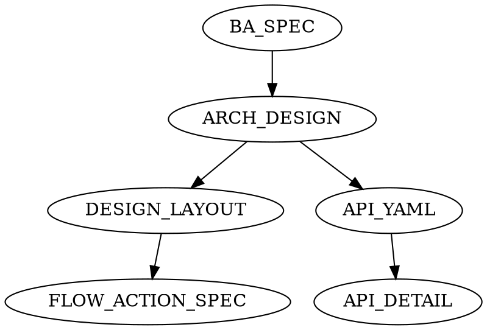

# SDTK-SPEC ARCH (Solution Architecture)

## Critical Constraints
- I do not generate `FLOW_ACTION_SPEC` before `DESIGN_LAYOUT` for UI-scope features.
- I do not let API, DB, and UI artifacts drift from the same BA and PM source of truth.

## Outputs
- `docs/architecture/ARCH_DESIGN_[FEATURE_KEY].md`
- If applicable:
  - `docs/api/[FeaturePascal]_API.yaml`
  - `docs/api/[FEATURE_KEY]_ENDPOINTS.md`
  - `docs/api/[FEATURE_KEY]_API_DESIGN_DETAIL.md`
  - `docs/api/[feature_snake]_api_flow_list.txt`
  - `docs/database/DATABASE_SPEC_[FEATURE_KEY].md`
  - `docs/design/DESIGN_LAYOUT_[FEATURE_KEY].md`
  - `docs/specs/[FEATURE_KEY]_FLOW_ACTION_SPEC.md`

## Flow Overview

## Process
1. Read BA spec and PRD/backlog.
2. Read `sdtk-spec.config.json` for project stack assumptions (backend/frontend/db/auth).
3. If architecture output includes API contracts/flows, read and apply:
   - `toolkit/templates/docs/api/YAML_CREATION_RULES.md`
   - `toolkit/templates/docs/api/API_DESIGN_FLOWCHART_CREATION_RULES.md`
   - `governance/ai/core/SDTK_API_PATH_STYLE_POLICY.md` for canonical resource naming and multi-word path style
4. If architecture output includes screen flow-action specs, read and apply `toolkit/templates/docs/specs/FLOW_ACTION_SPEC_CREATION_RULES.md`.
5. If API detail spec is required, use `sdtk-api-design-spec` to build/update `docs/api/[FEATURE_KEY]_API_DESIGN_DETAIL.md` using YAML + flow list.
6. For UI-scope features, enforce this generation sequence:
   a. Generate/update `docs/design/DESIGN_LAYOUT_[FEATURE_KEY].md` first (using `sdtk-design-layout`).
   b. Attempt to render screen preview images from the layout using `render_design_layout_images.py`. Output: `docs/specs/assets/<feature_snake>/screens/<screen_id>.svg`. If rendering fails (no Java/plantuml.jar), fall back to the render-skipped note -- do not silently skip.
   c. Then generate/update `docs/specs/[FEATURE_KEY]_FLOW_ACTION_SPEC.md` (using `sdtk-screen-design-spec`).
   d. The flow-action spec must reference the design-layout doc as its design source when no Figma/screenshot is available (Design Source Type: `generated-draft`). Use rendered `.svg` files as the screen image. If render failed, use the render-skipped note instead of a broken image reference.
7. For complex UI flow-action specs, use `sdtk-screen-design-spec` to build/update `docs/specs/[FEATURE_KEY]_FLOW_ACTION_SPEC.md`.
8. Define:
   - System components + data model
   - API endpoints and flows
   - Screen layouts
   - Security/authz decisions
9. Create/update:
   - OpenAPI YAML + API endpoint markdown
   - API flow list
   - API design detail spec (when `orchestration.apiDesignDetailMode` is `auto/on`)
   - Database spec (if DB impact exists)
   - Design layout (if UI impact exists) - must be created before flow-action spec
   - Flow-action spec (if UI impact exists) - must reference design layout as fallback source
10. Ensure mapping UC/BR -> DB/API/screens and run output hygiene checks:
    - EN artifacts use English narrative text (except clearly marked original-language appendix blocks)
    - No mojibake/encoding corruption in markdown/yaml/txt outputs
11. For workflow/tooling hardening batches that stop before `/dev`, lock the validator matrix, exact approved DEV surfaces, exact out-of-scope list, and explicit stop-before-`/dev` wording inside `ARCH_DESIGN_[FEATURE_KEY].md` before handoff.
12. For benchmark runs, apply `governance/ai/core/SDTK_BENCHMARK_OQ_POLICY.md`: keep benchmark-expected open questions explicitly OPEN unless the requirement source resolves them.
13. If anything is unclear, record OQ-xx in ARCH_DESIGN "Open Questions" and escalate to `@pm` for a decision.
14. Update shared state + Phase 3 checklist.
15. Handoff: `@dev please prepare FEATURE_IMPL_PLAN + CODE_HANDOFF for SDTK-CODE ...`.

## Order-Critical Hard Gate
For UI-scope features, do not generate or update `docs/specs/[FEATURE_KEY]_FLOW_ACTION_SPEC.md` until `docs/design/DESIGN_LAYOUT_[FEATURE_KEY].md` already exists and is current enough to serve as the design source for the same scope.

If the layout is missing, stale, or cannot support the flow-action spec, stop and fix the layout first. Do not reverse the order and repair it later.

## Common Mistakes

| Mistake | Why it is wrong | Do instead |
|---|---|---|
| Generate `FLOW_ACTION_SPEC` before `DESIGN_LAYOUT` for UI scope | Forces the spec to invent screen behavior without a design source | Create or refresh the layout first, then derive the flow-action spec |
| Treat API YAML, API detail, and flow-action outputs as independent documents | Causes naming and traceability drift across artifacts | Keep ARCH outputs linked through shared requirements and path policy |
| Close open questions silently during ARCH | Hides unresolved design decisions from downstream roles | Record `OQ-xx` explicitly and escalate through `@pm` |
| Hand off a workflow/tooling hardening batch without a validator matrix or exact DEV surface list | Leaves `/dev` and SDTK-CODE with an under-specified contract boundary | Lock the validator matrix, exact DEV surfaces, exact out-of-scope list, and stop-before-`/dev` wording before handoff |
