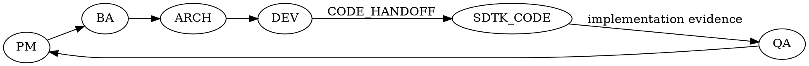

# SDTK-SPEC Orchestrator (multi-agent workflow)

## Critical Constraints
- I do not skip mandatory phases or hand off without current-phase evidence.
- I do not treat planned commands as equivalent to completed work.
- I preserve truthful fallback behavior and do not overclaim universal helper-dispatch or universal skill exposure across every runtime surface.
- If bounded audits are requested, they stay narrow, evidence-cited, and non-approval-bearing.

## Runtime Entrypoint Truth
- For Codex, project-local orchestrator support is bounded to explicit `CODEX_HOME=<project>/.codex`; `.codex/skills/sdtk-orchestrator` or helper dispatch do not prove direct built-in exposure.
- For Claude, visible-list presence of `orchestrator` does not prove `/orchestrator` or any other direct alias.
- `visible` and `working` are separate runtime checks; `working` requires observable controller action from a bounded request.
- Until runtime-specific direct syntax is validated, continue via the repo-local orchestrator contract in the current session.

## Initialize
- Ensure feature key + feature name exist (ask if missing).
- Read `sdtk-spec.config.json` (project stack + commands) if present.
- If `toolkit/scripts/init-feature.ps1` exists: run it to create skeleton artifacts; otherwise create the same files from `toolkit/templates/`.

## Execute pipeline (one phase per turn)
- Default role: PM (entry point) if user did not specify.
- Respect role tags: `/pm`, `/ba`, `/arch`, `/dev`, `/qa`.
- For each phase:
  - Create/update the phase artifact(s) in `docs/`.
  - If phase is ARCH and API contract/flow is in scope, invoke `sdtk-api-doc` to produce/update `docs/api/[FeaturePascal]_API.yaml`, `docs/api/[FEATURE_KEY]_ENDPOINTS.md`, and `docs/api/[feature_snake]_api_flow_list.txt`.
  - If phase is ARCH and API detail spec is in scope, invoke `sdtk-api-design-spec` to produce/update `docs/api/[FEATURE_KEY]_API_DESIGN_DETAIL.md`.
  - If phase is ARCH and UI flow behavior is in scope, invoke `sdtk-screen-design-spec` to produce/update `docs/specs/[FEATURE_KEY]_FLOW_ACTION_SPEC.md`.
  - If phase is DEV, stop at `FEATURE_IMPL_PLAN + CODE_HANDOFF`; do not claim the orchestrator completed downstream code execution.
  - If phase is QA and test-case specification is in scope, invoke `sdtk-test-case-spec` to produce/update `docs/qa/[FEATURE_KEY]_TEST_CASE.md`.
  - If phase is QA and controller review is in scope, preserve `docs/qa/QA_RELEASE_REPORT_[FEATURE_KEY].md` as the primary QA output and `docs/qa/CONTROLLER_ACCEPTANCE_[FEATURE_KEY].md` as the separate persisted controller verdict artifact.
  - If QA or controller rejects a batch, route the next pass only through a bounded targeted-fix loop with explicit allowed surfaces and refresh order: `verify -> QA -> controller`.
  - Update `SHARED_PLANNING.md` (phase row + activity log).
  - Update `QUALITY_CHECKLIST.md` (mark items PASS/Pending).
  - Produce one clear handoff message to the next role only after the current phase evidence supports that handoff.

## API design detail mode (Hybrid)
- Read `sdtk-spec.config.json` key: `orchestration.apiDesignDetailMode`.
- Supported values:
  - `auto` (default): run `sdtk-api-design-spec` when ARCH has API scope and YAML + flow list are available.
  - `on`: always run `sdtk-api-design-spec` for API scope (fail fast if required inputs are missing).
  - `off`: skip API design detail generation unless user explicitly requests it.

## Test-case spec mode (Hybrid)
- Read `sdtk-spec.config.json` key: `orchestration.testCaseSpecMode`.
- Supported values:
  - `auto` (default): run `sdtk-test-case-spec` when QA phase requires reusable test-case artifact.
  - `on`: always run `sdtk-test-case-spec` for QA phase (fail fast if required inputs are missing).
  - `off`: skip test-case spec generation unless user explicitly requests it.

## Optional: Mailbox Dispatch
- Use `sdtk-mailbox-dispatch` when one bounded controller-owned phase should be delegated to Claude or Codex.
- Keep planning local when the controller already has enough repo context.
- Lock exact include/exclude boundaries, fallback triggers, and verification commands before dispatch.
- Keep mailbox runtime files transient under `governance/ai/agent-mailbox/runtime/`.
- Run the default post-issue mailbox retrospective after repo truth is closed and before the next mailbox-driven issue.

## Flow Overview

## Verification Before Completion
Apply `governance/ai/core/SDTK_VERIFICATION_BEFORE_COMPLETION_POLICY.md` whenever you mark a phase complete, mark a gate PASS, or hand off to the next role. Require fresh verification evidence before you state that the phase is done.

Do not:
- say a phase is done or PASS without citing the evidence that proves it
- treat a planned command as equivalent to an executed command
- hand off DEV or QA work with overstated verification status

If the evidence is incomplete, keep the phase open or mark it blocked instead of overstating completion.

## Guardrails
- Do not skip phases; if prerequisites are missing, ask focused questions.
- Keep traceability: REQ -> BR/UC/AC -> design -> backlog -> FEATURE_IMPL_PLAN -> CODE_HANDOFF -> downstream implementation evidence -> QA report.
- Default bridge is `/dev -> SDTK-CODE -> /qa`.
- Preserve truthful fallback behavior when helper dispatch or built-in skill exposure is unavailable; repo-local contract execution remains valid evidence of workflow support.
- Keep bounded audits narrow, evidence-cited, and non-approval-bearing; the controller remains the only final acceptance authority.
- Do not widen a targeted-fix loop beyond the exact findings that triggered the rejection.
- If input requirements are VI/JP: preserve original text + add EN translation in appendix for traceability (at least in Project Initiation and BA spec).

## Common Mistakes

| Mistake | Why it is wrong | Do instead |
|---|---|---|
| Skip directly from PM to DEV because the request seems small | Breaks traceability and removes BA and ARCH controls | Keep phase order unless the user explicitly narrows scope with acceptable evidence |
| Hand off a phase based on planned checks instead of executed evidence | Creates false PASS status and weakens downstream gates | Require fresh evidence before marking the phase complete |
| Mix generation, review, and release decisions in one uncontrolled turn | Makes status tracking ambiguous | Complete one phase handoff at a time and update shared state before moving on |
| Claim helper-dispatch or skill exposure is universal across every runtime surface | Overstates runtime guarantees and breaks truthful fallback behavior | State the verified surface only and keep the repo-local fallback explicit |
| Use mailbox dispatch as a generic worker platform or reopen broad planning through it | Wastes controller time and weakens boundary discipline | Keep mailbox delegation bounded, preserve exact boundaries, and prefer local planning when context is already strong |
| Let a bounded audit issue the final verdict or replace QA/controller review | Breaks authority boundaries and creates ambiguous approval ownership | Keep audits narrow and evidence-cited, then return the findings to QA/controller |
| Let a rejected batch jump straight to ship or PM closure | Breaks the targeted-fix refresh order and hides unresolved findings | Route rejected batches through the bounded loop `verify -> QA -> controller` before any later phase |
