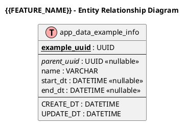

# DATABASE SPECIFICATION: {{FEATURE_KEY}}

**Document ID:** DATABASE_SPEC_{{FEATURE_KEY}}
**Version:** 1.0.0
**Date:** {{DATE}}
**Author:** ARCH Agent
**Status:** DRAFT
**Source:** `docs/specs/BA_SPEC_{{FEATURE_KEY}}.md`, `docs/architecture/ARCH_DESIGN_{{FEATURE_KEY}}.md`

---

## Abbreviations

| No | Abbreviation | Meaning |
| ---: | --- | --- |
| 1 | DB | Database |
| 2 | PK | Primary Key |
| 3 | FK | Foreign Key |
| 4 | ERD | Entity Relationship Diagram |
| 5 | OQ | Open Question |

---

## Table of Contents

1. [Overview](#1-overview)
2. [ERD Diagram (PlantUML)](#2-erd-diagram-plantuml)
3. [Core Tables](#3-core-tables)
4. [Related/Referenced Tables](#4-relatedreferenced-tables)
5. [Settings Storage](#5-settings-storage)
6. [Indexes & Constraints](#6-indexes--constraints)
7. [Open Questions](#7-open-questions)
8. [Document History](#document-history)

---

## 1. Overview

### 1.1 Scope
- Describe database scope for `{{FEATURE_NAME}}`.
- Clarify whether each table is new/modified/reused.

### 1.2 Table Categories

| No | Category | Tables | Purpose |
| ---: | --- | --- | --- |
| 1 | Core (New/Modified) | TBD | Main feature tables |
| 2 | Referenced (Existing) | TBD | Existing tables reused by feature |
| 3 | Settings | TBD | Configuration storage |

### 1.3 Naming Conventions

| No | Prefix | Type | Example |
| ---: | --- | --- | --- |
| 1 | `app_data_` | Data table | `app_data_example_info` |
| 2 | `app_master_` | Master table | `app_master_example_info` |

---

## 2. ERD Diagram (PlantUML)

### 2.1 ERD Summary
- Summarize key relations and ownership boundaries.

---

## 3. Core Tables

### 3.1 app_data_example_info (Example Info)

| No | Column Name (JP) | Column Name | Data Type | Size | Key | Nullable | Default | Description |
| ---: | --- | --- | --- | --- | --- | --- | --- | --- |
| 1 | Example UUID (JP) | example_uuid | UUID | - | PK | No | - | Primary key |
| 2 | Parent UUID (JP) | parent_uuid | UUID | - | FK | Yes | NULL | Parent reference |

### 3.2 app_data_example_detail_info (Example Detail)

| No | Column Name (JP) | Column Name | Data Type | Size | Key | Nullable | Default | Description |
| ---: | --- | --- | --- | --- | --- | --- | --- | --- |
| 1 | Detail UUID (JP) | example_detail_uuid | UUID | - | PK | No | - | Primary key |

---

## 4. Related/Referenced Tables

### 4.1 app_data_related_info (Related Entity)

| No | Key Column | Type | Description |
| ---: | --- | --- | --- |
| 1 | related_uuid | UUID | Referenced by core table |

---

## 5. Settings Storage

### 5.1 Environment Settings Table

| No | Setting | category1 | category2 | key | value_type | Example Value | Description |
| ---: | --- | --- | --- | --- | --- | --- | --- |
| 1 | TBD | TBD | TBD | TBD | string | TBD | TBD |

---

## 6. Indexes & Constraints

### 6.1 Recommended Indexes

#### app_data_example_info

| No | Index Name | Columns | Type | Purpose |
| ---: | --- | --- | --- | --- |
| 1 | idx_example_parent | parent_uuid | BTREE | Parent lookup |

### 6.2 Foreign Key Constraints

| No | Constraint Name | From Table.Column | To Table.Column | On Update | On Delete |
| ---: | --- | --- | --- | --- | --- |
| 1 | fk_example_parent | app_data_example_info.parent_uuid | app_data_related_info.related_uuid | RESTRICT | SET NULL |

### 6.3 Check Constraints

| No | Constraint Name | Expression | Purpose |
| ---: | --- | --- | --- |
| 1 | chk_example_range | start_dt < end_dt | Validate datetime range |

---

## 7. Open Questions

### 7.1 Questions Requiring Clarification

| No | Q-ID | Area | Question | Impact | Priority | Status | Resolution |
| ---: | --- | --- | --- | --- | --- | --- | --- |
| 1 | Q-01 | Schema | TBD | TBD | High | OPEN | TBD |

### 7.2 Missing Information
- List unresolved schema details (size/default/nullability/code maps).

---

## Document History

| No | Version | Date | Author | Changes |
| ---: | --- | --- | --- | --- |
| 1 | 1.0.0 | {{DATE}} | ARCH Agent | Initial template-based version |
