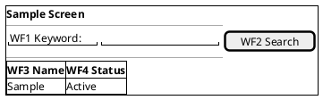

# Screen Layout Design: {{FEATURE_KEY}} ({{FEATURE_NAME}})

**Document ID:** DESIGN_LAYOUT_{{FEATURE_KEY}}
**Version:** 1.0.0
**Date:** {{DATE}}
**Author:** ARCH Agent
**Status:** DRAFT - Ready for DEV Review

---

## Abbreviations

| No | Abbreviation | Meaning |
| ---: | --- | --- |
| 1 | UI | User Interface |
| 2 | API | Application Programming Interface |
| 3 | OQ | Open Question |

---

## Screen List

| No | Screen ID | Screen Name | Description |
| ---: | --- | --- | --- |
| 1 | A-1 | TBD | TBD |

---

## A-1. TBD

> Generated outputs should use screen-local visual markers that reset per screen. Prefer Unicode circled-number markers in the real doc. The ASCII placeholders below keep this template PowerShell-safe, and `FLOW_ACTION_SPEC` will map the local markers to its global action-table numbers.

### API List

| No | API ID | Endpoint |
| ---: | --- | --- |
| 1 | API-1 | TBD |

### Items

| No | Item | Type | Required | Notes |
| ---: | --- | --- | --- | --- |
| 1 | TBD | text | - | TBD |
