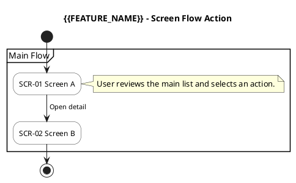

# {{FEATURE_NAME}} - Screen Flow Action Specification

**Document ID:** {{FEATURE_KEY}}_FLOW_ACTION_SPEC
**Version:** 1.0.0
**Date:** {{DATE}}
**Author:** ARCH Agent
**Status:** DRAFT
**Related Specs:** `docs/specs/BA_SPEC_{{FEATURE_KEY}}.md`, `docs/api/{{FEATURE_KEY}}_ENDPOINTS.md`, `docs/database/DATABASE_SPEC_{{FEATURE_KEY}}.md`

---

## Abbreviations

| No | Abbreviation | Meaning |
| ---: | --- | --- |
| 1 | UI | User Interface |
| 2 | UX | User Experience |
| 3 | API | Application Programming Interface |
| 4 | FE | Frontend |
| 5 | BE | Backend |
| 6 | OQ | Open Question |

---

## 1) Feature overview

### 1.1 Background and user needs
- TBD

### 1.2 Target features in scope
- TBD

### 1.3 Implementation direction
- TBD

## Assumptions

| # | Assumption | Verified | Risk if wrong |
| ---: | --- | --- | --- |
| 1 | TBD | No | TBD |

---

## 2) Screen flow action

### 2.1 Flow diagram (PlantUML)

### 2.2 Mapping to major screens

| No | Screen Group | Screen Name | Screen ID | Notes |
| ---: | --- | --- | --- | --- |
| 1 | Main | Screen A | SCR-01 | TBD |
| 2 | Main | Screen B | SCR-02 | TBD |

---

## 3) Screen layout spec by flow action

> Standard item table format:
> `No | Item Name | Item Type | Attribute | DB Column | Size | Default Value | Action | Description | Note`

### 3.1 Screen A

Information:
- Screen ID: SCR-01
- Design Source Type: source-backed | generated-draft | none
- Design Source Reference: Figma URL | screenshot path | `docs/design/DESIGN_LAYOUT_{{FEATURE_KEY}}.md` section reference | `N/A - no UI scope`

Screen image:
<!-- Use a file-relative markdown path from docs/specs/, not a project-root docs/specs/assets/... path. -->

<!-- If the .svg file does not exist (render unavailable), replace the image line above with: -->
<!-- > Screen image not rendered in this environment. See Design Source Reference for layout. -->

#### Wireframe Marker Mapping (Draft)

> Generated-draft wireframe markers are screen-local visual references. Map each visible marker to the global action-table `No` used below.

| No | Wireframe Marker | Action Table No | Item Name | Notes |
| ---: | --- | ---: | --- | --- |
| 1 | marker-1 | 1 | Item A | Visible on wireframe |
| 2 | marker-2 | 2 | Item B | Visible on wireframe |

| No | Item Name | Item Type | Attribute | DB Column | Size | Default Value | Action | Description | Note |
| ---: | --- | --- | --- | --- | --- | --- | --- | --- | --- |
| 1 | Item A | Button | - | - | - | - | Click | TBD | TBD |
| 2 | Item B | Input | string | column_a | 100 | empty | Input | TBD | TBD |

#### API Mapping (Draft)

| No | Trigger/When | UI item (No / Item Name) | API to call | Data usage / Notes |
| ---: | --- | --- | --- | --- |
| 1 | Initial load | Main area | `GET /api/...` | Load initial dataset |
| 2 | Click search | No 1 | `POST /api/.../search` | Refresh grid |

---

### 3.2 Screen B

Information:
- Screen ID: SCR-02
- Design Source Type: source-backed | generated-draft | none
- Design Source Reference: Figma URL | screenshot path | `docs/design/DESIGN_LAYOUT_{{FEATURE_KEY}}.md` section reference | `N/A - no UI scope`

Screen image:
<!-- Use a file-relative markdown path from docs/specs/, not a project-root docs/specs/assets/... path. -->

<!-- If the .svg file does not exist (render unavailable), replace the image line above with: -->
<!-- > Screen image not rendered in this environment. See Design Source Reference for layout. -->

#### Wireframe Marker Mapping (Draft)

> Generated-draft wireframe markers are screen-local visual references. Map each visible marker to the global action-table `No` used below.

| No | Wireframe Marker | Action Table No | Item Name | Notes |
| ---: | --- | ---: | --- | --- |
| 1 | marker-1 | 3 | Item C | Visible on wireframe |

| No | Item Name | Item Type | Attribute | DB Column | Size | Default Value | Action | Description | Note |
| ---: | --- | --- | --- | --- | --- | --- | --- | --- | --- |
| 3 | Item C | Toggle | boolean | flag_a | - | false | Toggle | TBD | TBD |

#### API Mapping (Draft)

| No | Trigger/When | UI item (No / Item Name) | API to call | Data usage / Notes |
| ---: | --- | --- | --- | --- |
| 1 | Change mode | No 3 | `POST /api/.../edit/{uuid}` | Persist mode |

---

## 4) System processing flow

### 4.1 Initial load
1. Validate screen permissions.
2. Load settings/profile context.
3. Load main dataset.

### 4.2 Create/Update/Delete flow
1. Validate request.
2. Execute write API.
3. Refresh read dataset.

---

## 5) Notes

- Keep item numbering strategy explicit (`global` or `per-screen`).
- Do not duplicate item descriptions across screens unless behavior differs.

---

## 6) Open questions

| No | Scope | Question | Impact |
| ---: | --- | --- | --- |
| 1 | UI | TBD | TBD |
| 2 | API | TBD | TBD |

---

## 7) Screen - API Mapping

| No | Screen (section) | Screen ID | Read/Search APIs | Write APIs | Notes / Q&A refs |
| ---: | --- | --- | --- | --- | --- |
| 1 | 3.1 Screen A | SCR-01 | `GET /api/...` | `POST /api/...` | TBD |
| 2 | 3.2 Screen B | SCR-02 | `POST /api/.../search` | `POST /api/.../edit/{uuid}` | TBD |

---

## Document History

| No | Version | Date | Author | Changes |
| ---: | --- | --- | --- | --- |
| 1 | 1.0.0 | {{DATE}} | ARCH Agent | Initial template-based version |
